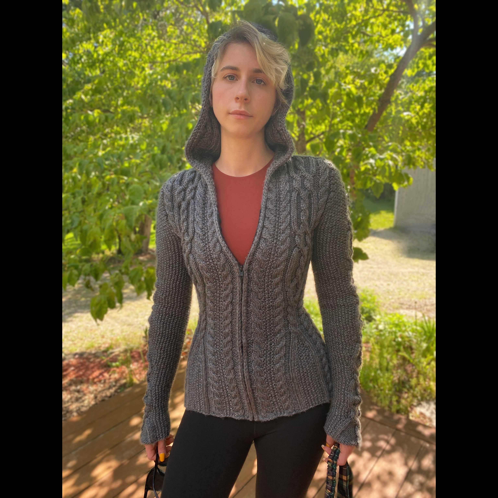

---
output:
  html_document: default
  pdf_document: default
---
# My life in Quarantine
### Althea Bock-Hughes

## Quarantine projects included:

* Knitting

* Baking Sourdough Bread

* Watching "Avatar the Last Airbender" for the first time 

* Tanning 

* Occasionally thinking about science 

My most involved project was **knitting** 
I knit *four* sweaters in Quarantine

1. This was the first one I knit and the hardest 

2. Here is the back of the sweater 

 

3. Here is a link to the sweater pattern so you can make it too! 
[Sweater Pattern Link](https://www.ravelry.com/patterns/library/vivian)

**Ok Love You! Stay Safe!** 

