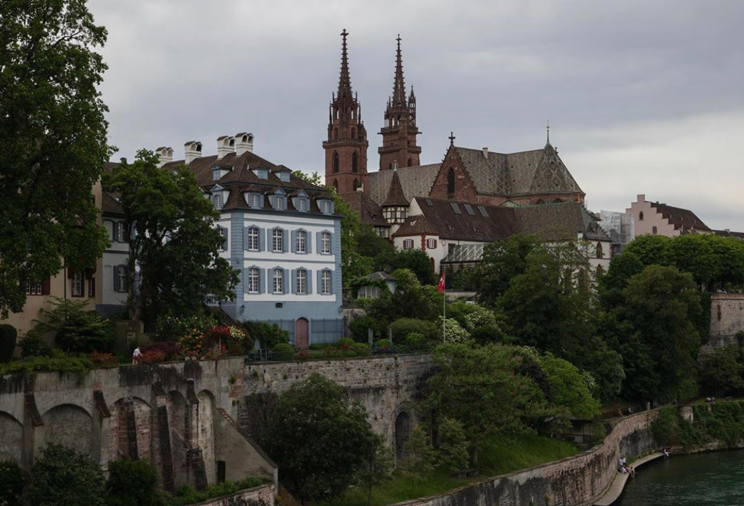

# HW01

## Patrick Haller   

### Biography   

Hi all! My name is Patrick Haller, and I am an incoming **Biochemistry and Molecular Biophysics** student. I was born and raised in Basel, Switzerland. Here's a picture of my hometown:   

   

 
I moved to the U.S. at the age of 16. This past spring, I graduated from the [University of Miami](https://welcome.miami.edu/), where I worked in a *Schizosaccharomyces pombe* lab.    

Outside of school, I like to:   
- stay active, especially play soccer   
- watch new movies and listen to music   
- travel and explore new places   

