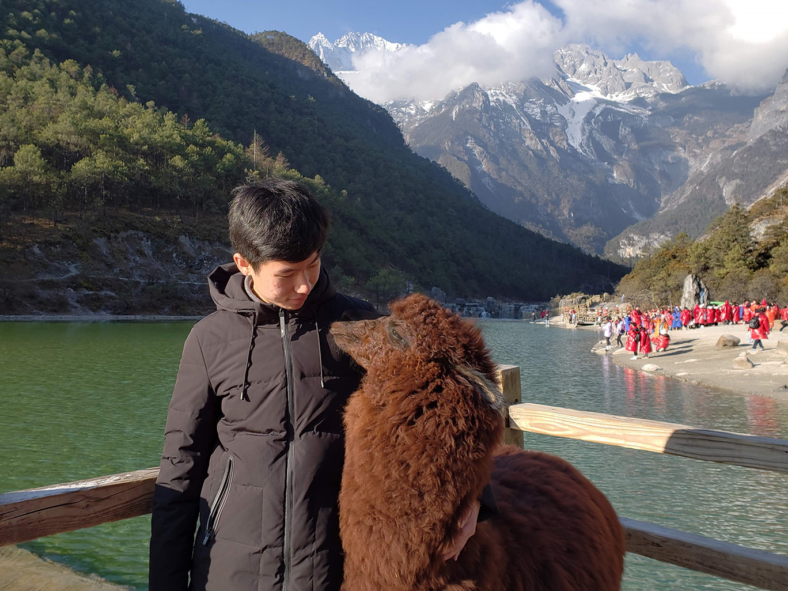

# HW01: A Brief Introduction of My Self

## Who am I

Hi there! I am **Yujia Liu** and you can call me **Randolph**. I am from **China (mainland)**. I spent a fall semester and a summer at UC Berkeley. It was a great time and I made incredible friends. During that time, I made a [webpage](http://isolates.genomics.lbl.gov) to help them sort out the isolates of microbes. My academic interest cross a wide range, including microbiology, genomics and protein structures. But overall, I am interested in how to apply quantitative methods to study these questions. I really hope the BMB program here at UChicago will motivate me to explore more on these topics!

Why I pick *Randolph* as my English name? I originally used *Rain* as my name, since the *Yu* character in Chinese means *Rain*. Later I realize I need a name that is not so common, so I (kind of randomly) chose *Randolph*, which also starts with an "R".

Here is a photo of me:

<small>Yujia and the alpaca</small>

## Cuisines in my hometown

I live in Guangzhou, a city in the southern part of China. Guangzhou is famous for all kinds of local cuisines (Cantonese Cuisine). Here is my must-try dish list:

- Rice noodle roll
- Cha siu bao (barbecue-pork-filled bun)
- Wonton noodles
- Double skin milk

And my personal favourite:

- Coconut pudding

## Thoughts at the moment

I think this is a very hard time for all the international students coming to the US, especially for those from China. Are you positive that we can fight the COVID-19 pandemic in the US? Do you think the Chinese are labeled with the stereotype of virus? Or are you also an international student feeling difficult to travel to the US? Let's share our thoughts and help each other!