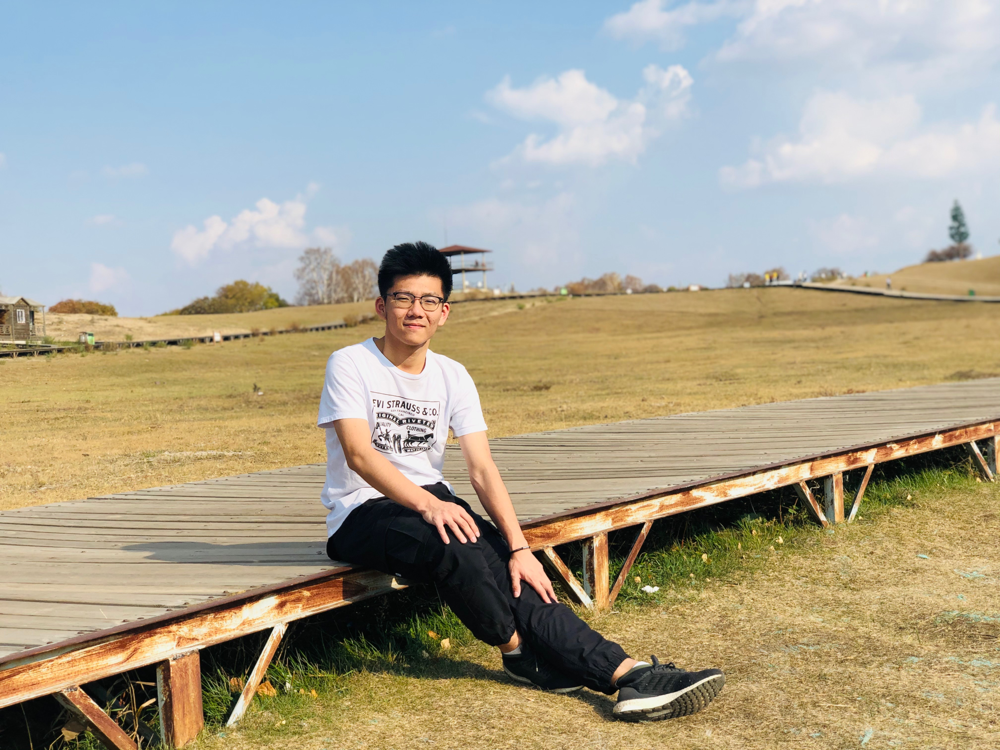

# HW01
## Mini Bio of Lai Wei
My name is **Lai Wei**. I just graduated from Peking University in China, and am a newly admitted PhD student of the Neurobiology program. I've worked in multiple projects through my undergraduate study:

1. Neuronal primary cilia in regulating neuron excitability and axon initial segment plasticity (Apr. 2018 – Present, at Peking University)

2. Candidate genes in Aβ RA- and Aδ-Low Threshold Mechanoreceptors (Jun. 2019 - Sep. 2019, at Harvard Medical School)

I do not have a personal link to share with you all, but I can absolutely upload one of my photograph. 

